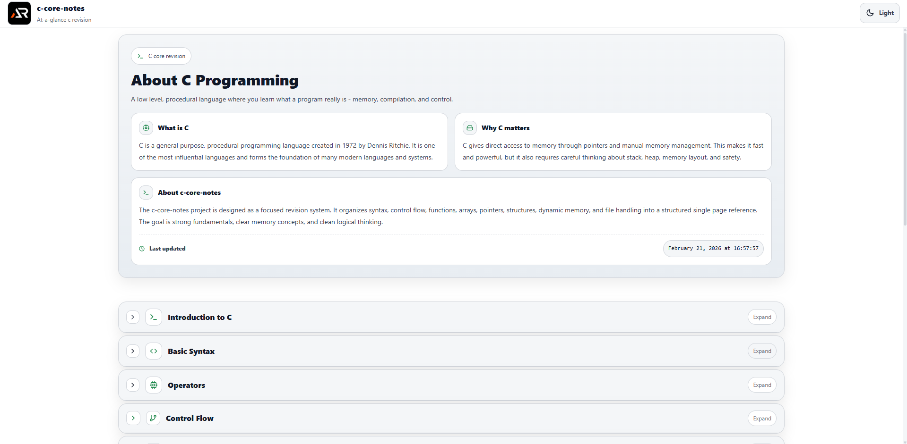

# C Core Notes

A focused React and Vite revision workspace for core C programming concepts, from syntax and control flow to pointers, memory, files, and data structures.



## Features

- Modular topic sections for quick revision
- Expandable notes with practical C examples
- Dark and light themes
- Responsive layout with keyboard-friendly controls
- Topics covering pointers, memory, arrays, strings, files, bitwise operations, and best practices

## Run locally

```bash
npm install
npm run dev
```

Build with `npm run build` and deploy to GitHub Pages with `npm run deploy`.

## Links

- Live: https://a2rp.github.io/c-core-notes/
- Repository: https://github.com/a2rp/c-core-notes
- Portfolio: https://www.ashishranjan.net/
- GitHub: https://github.com/a2rp
- CodePen: https://codepen.io/ash1198
- LinkedIn: https://www.linkedin.com/in/aashishranjan
- Facebook: https://www.facebook.com/theash.ashish/
- YouTube: https://www.youtube.com/@ashishranjan-ashz?sub_confirmation=1
- Email: mailto:ash.ranjan09@gmail.com

## Support

- Support: https://a2rp-donation-page.netlify.app/
- Buy Me a Coffee: https://buymeacoffee.com/a2rp
- Patreon: https://www.patreon.com/a2rp
